# Charlie

<<<<<<< HEAD
Charlie is a safety-first physical AI system that turns a spoken request into a
grounded, simulated, and locally validated robot action. Instead of asking one
large model to do everything, Charlie coordinates specialized models for
speech, vision, intent grounding, planning, manipulation, dynamics, reward,
and outcome verification.
=======
 Demo: https://youtube.com/shorts/cJ961L4WOBA

This repository is an OpenRouter-style gateway for physical AI. The RTX laptop
is the robot's brain: it captures the CO6 webcam and microphone, stores personal
memory, routes exact specialist contracts, plans actions, and evaluates parallel
2-3 second predictions. Baseten can host those specialists independently. The
Raspberry Pi 4B is the robot computer. It has no cloud credentials and accepts
only authenticated, bounded motion chunks that match its calibrated robot model.
It independently enforces command identity, timing, joint and gripper envelopes,
owns the PCA9685, and keeps the emergency stop local to the motors.
>>>>>>> f7f28aea3fad0439208425ebc34359d94ff61156

Baseten is Charlie's inference fabric. It hosts the semantic router and task
planner as Chains, provides the multimodal Model API used for scene and language
reasoning, and gives each custom specialist an independent deployment boundary.
The RTX laptop composes those services and keeps state; the Raspberry Pi owns
the camera and the final motor-control boundary. A cloud response can propose or
score an action, but it can never directly drive a servo.

Say **"Hey Charlie"** to begin a live voice interaction.

> The public system is Charlie. The Python package, CLI command, and existing
> `MOIRA_*` environment variables retain their original names for compatibility.

## How Charlie is put together

```mermaid
flowchart TB
    USER["User: Hey Charlie..."] --> MIC[Microphone]
    MIC --> STT[Whisper speech-to-text]
    CAM[CO6 webcam] --> PI["Raspberry Pi<br/>camera + robot service"]
    PI -->|authenticated frame| ORCH
    STT --> ORCH["Charlie on RTX laptop<br/>orchestration + memory"]

    subgraph BT[Baseten]
        ROUTER["MiniLM Router Chain"]
        VISION["Multimodal scene perception"]
        GROUND["Scene-grounded command understanding"]
        PLANNER["Task Planner Chain"]
        SPECIALISTS["Independently deployed specialists"]
    end

    ORCH --> VISION
    ORCH --> GROUND
    ORCH --> PLANNER
    ORCH -->|task text + compatible IDs only| ROUTER
    ROUTER -->|one component ID| ORCH
    ORCH --> SPECIALISTS

    SPECIALISTS --> FUTURES["Parallel 2-3 second future predictions"]
    FUTURES --> SAFE["Local IK + trajectory + collision + safety"]
    SAFE --> CONFIRM["Plan preview + fresh user confirmation"]
    CONFIRM -->|authenticated bounded action chunks| PI
    PI --> LIMITS["Identity + timing + servo envelope checks"]
    LIMITS --> PCA[PCA9685]
    PCA --> ARM[Fixed-elbow desktop arm]
    ARM --> VERIFY[Post-action observation + feedback]
    VERIFY --> ORCH
    ORCH --> TTS[Kokoro speech]
    TTS --> USER
```



The split is intentional:

- **Baseten runs model inference.** Models can be deployed, scaled, and updated
  independently without moving credentials or large runtimes onto the robot.
- **The RTX laptop runs Charlie.** It captures voice, holds personal memory,
  applies the component allow-list, calls Baseten, validates every typed
  response, simulates candidates, journals runs, and prepares bounded motion.
- **The Raspberry Pi owns the hardware boundary.** It serves camera frames,
  revalidates every motion request, owns the PCA9685, and keeps stop handling
  next to the motors.

If the camera, router, network, response schema, specialist, or safety check
fails, the production path stops. Charlie does not silently swap in a different
model and continue toward physical execution.

## What Baseten does for Charlie

Baseten is more than a single model endpoint in this system. Charlie uses three
parts of the platform for different jobs.

### 1. The semantic Router Chain

The laptop first filters the component registry by exact capability, schema,
runtime, and safety role. It then sends the current task text and only those
compatible component IDs to the Baseten Router Chain.

The Chain packages Charlie's fine-tuned MiniLM encoder and specialist metadata.
For a real choice between multiple compatible specialists, it embeds the task,
compares it with each specialist's normalized metadata prototypes, and returns
the strongest component ID plus scores. If there is only one compatible
provider, the request is resolved as a contract singleton; there is no semantic
guess to make.

The router never receives motor authority and never returns a URL, secret, or
command. Charlie checks the returned ID against the original allow-list before
looking up the endpoint in local configuration.

The deployable Chain is in [deploy/baseten_router](deploy/baseten_router), and
the specialist catalog is in
[examples/physical_ai_specialists.json](examples/physical_ai_specialists.json).

### 2. The physical Task Planner Chain

The Baseten Planner Chain has two typed responsibilities:

1. Create a small set of candidate plans from the grounded intent, observed
   scene, grasp poses, installed arms, and user constraints.
2. Select only from the exact candidates Charlie has already validated and
   simulated.

The planner cannot invent a new final plan after simulation. Charlie compares
the selected candidate and simulation payload structurally with the originals.
The Chain implementation and active arm profile live in
[deploy/baseten_planner](deploy/baseten_planner).

### 3. Model API and dedicated model deployments

The active runtime uses Baseten's OpenAI-compatible Model API with
`zai-org/GLM-5.3-Flash` for two structured reasoning stages:

- **Scene perception:** turns calibrated camera evidence into typed objects,
  positions, confidence values, surfaces, and hazards.
- **Voice grounding:** maps the transcript onto object IDs that actually exist
  in the perceived scene, extracting the action, object roles, and constraints.

Both calls request strict JSON structures. Charlie decodes them into internal
types and rejects invented object IDs, malformed outputs, missing prediction
horizons, mismatched plan IDs, and other contract violations.

The repository also contains Truss packages for dedicated Baseten deployments:

| Package | Role | Model |
| --- | --- | --- |
| [deploy/baseten_vision](deploy/baseten_vision) | Calibrated open-vocabulary detection | Grounding DINO Tiny |
| [deploy/baseten_voice_nlp](deploy/baseten_voice_nlp) | Scene-grounded command parsing | Qwen 2.5 3B Instruct |
| [deploy/baseten_whisper](deploy/baseten_whisper) | Speech transcription | Whisper Large V3 Turbo |
| [deploy/baseten_tts](deploy/baseten_tts) | Spoken confirmations and status | Kokoro-82M |

These deployment packages use the same typed contracts as the active runtime,
so a component can move from a laptop service to Baseten without changing the
orchestration logic. Transport is configuration, not task logic.

### Current service placement

[config/pi4_runtime.json](config/pi4_runtime.json) is the source of truth for
the current topology. It contains endpoint variable names and component
transports, but no credentials.

| Capability | Current placement |
| --- | --- |
| Semantic specialist routing | Baseten Router Chain |
| Scene perception | Baseten Model API |
| Scene-grounded command understanding | Baseten Model API |
| Candidate generation and final selection | Baseten Planner Chain |
| Whisper STT and Kokoro TTS | RTX laptop JSON services |
| Grasp, waypoint, dynamics, rigid/contact world, reward, outcome | Learned waypoint/dynamics checkpoints plus explicit local model-based specialists in the current motor-locked profile; remote endpoint contracts are already defined |
| Personal memory and run journal | Laptop SQLite and JSONL |
| IK, trajectory generation, collision checks, hard safety | Laptop, loaded from the validated robot model |
| Camera, request validation, emergency stop, PWM | Raspberry Pi |

Logical IDs such as `baseten-waypoint-policy` are stable component identities.
The runtime configuration determines whether that component is backed by a
Baseten deployment, another authenticated JSON service, or an explicitly
declared local integration implementation. Judge-facing output translates these
IDs into role names such as **Movement Specialist**, **Vision Specialist**,
**Task Planning Specialist**, and **Motion Prediction Specialist**. The internal
IDs appear only as secondary diagnostics.

## What happens after “Hey Charlie”

One request moves through the following bounded workflow:

1. **Capture and transcribe.** The laptop records a short command and Whisper
   produces the transcript. A local stop phrase bypasses the remaining cloud
   workflow and latches the motor stop.
2. **Observe the workspace.** Charlie requests a timestamped JPEG from the
   authenticated Pi camera endpoint and asks the Baseten vision model for a
   structured world state.
3. **Recall personal context.** Laptop SQLite returns preferences,
   accommodations, recent comments, and previously measured object facts.
   Memory may shape a plan, but it cannot silently supply an omitted target.
4. **Ground the command.** The Baseten language model binds words such as “the
   red block” and “the tray” to object IDs from the current scene. If a required
   role is ambiguous or missing, Charlie asks a spoken clarification and waits.
5. **Generate grasps and candidates.** The grasp specialist proposes bounded
   poses. The Planner Chain creates a small set of complete candidate plans
   supported by the installed arm configuration.
6. **Route each candidate.** The typed registry builds the compatible
   manipulation pool. The Router Chain chooses the waypoint, pour, insert,
   lid-opening, handover, or bimanual policy that best matches the candidate.
7. **Validate motion locally.** Charlie converts policy chunks into robot-model
   IK, a timed trajectory, and a collision report. Infeasible candidates remain
   visible in the comparison but cannot be selected for execution.
8. **Predict futures in parallel.** Each viable candidate is evaluated by
   forward dynamics and the relevant rigid, contact, bimanual, deformable, or
   human-motion world models over the configured 2-3 second horizon.
9. **Score and gate.** A reward specialist scores task progress. Local safety
   fuses collision clearance, predicted risk, tactile slip, grasp stability,
   uncertainty, and the robot's calibrated limits. If every candidate is unsafe,
   the request ends before control.
10. **Select and explain.** The Planner Chain may choose only one of the supplied
    safe simulations. Charlie reads back the grounded request and selected plan.
11. **Confirm.** Physical execution requires a fresh “yes” bound to the exact
    grounded intent, observed targets, and candidate ID. A correction triggers
    grounding, routing, planning, and prediction again. If the new result
    differs, the old confirmation is invalid.
12. **Reobserve and execute.** Charlie captures another frame immediately before
    motion and between action steps. Moved targets, missing objects, or new
    hazards stop the run. The Pi accepts only authenticated, non-duplicate,
    time-bounded chunks tied to the expected robot model and plan.
13. **Verify and learn.** A post-action frame and control telemetry feed outcome
    verification, failure classification, load estimation, and per-model
    prediction error. The result is journaled and useful facts are written back
    to personal memory.
14. **Respond.** Kokoro speaks the completion, failure, clarification, or safety
    message.

Camera and audio bytes are not stored in the run journal. The journal keeps
their sizes and capture metadata alongside the transcript, routing decisions,
candidates, simulations, selected plan, telemetry, outcome, and feedback.

## Typed contracts keep models interchangeable

Charlie never routes arbitrary JSON between arbitrary models. Every component
declares a layer and one or more exact capabilities, for example:

| Stage | Capabilities |
| --- | --- |
| Perception and voice | `perception.scene`, `voice.transcribe`, `voice.ground`, `voice.synthesize` |
| Planning and grasping | `planning.candidates`, `planning.select`, `grasp.pose_6d` |
| Manipulation | `manipulation.skill.waypoint`, `.pour`, `.insert`, `.open_lid`, `.handover`, `manipulation.bimanual` |
| Local motion | `kinematics.inverse`, `motion.trajectory`, `motion.collision_check` |
| Prediction | `dynamics.predict`, `world.rigid_dynamics`, `world.grasp_contact`, `world.bimanual_coordination`, `world.deformable_dynamics`, `world.human_motion` |
| Choice and safety | `reward.task_progress`, `safety.risk` |
| Control and feedback | `control.single_arm`, `outcome.verify`, `failure.classify`, `load.estimate`, `feedback.prediction_error`, `feedback.learn` |

The allow-list is
[examples/pi4_components.json](examples/pi4_components.json). Remote payloads
are decoded by `moira.contracts.decode_physical_response` before another stage
can consume them. The registry also marks local-authority capabilities, so a
remote component cannot be selected for motor control, tactile enforcement,
IK, collision checking, or other protected operations.

## Safety and motor authority

Charlie's model layer is advisory; motor authority is deliberately local.

- The active robot model supplies joint geometry, limits, gripper bounds,
  channel assignments, timing, and calibration. Driver code does not invent
  missing measurements.
- Plan-only runs cannot command hardware.
- Physical runs require current robot state, an exact-plan confirmation, fresh
  camera observations, and a motion-ready robot model.
- The Pi verifies robot identity, model digest, plan/chunk binding, timestamps,
  request uniqueness, joint limits, gripper limits, and the motion-enabled flag.
- The PCA9685 is opened lazily only after an authenticated execution request.
- A local stop phrase runs alongside authorized movement. Stop is latched until
  the operator checks the workspace and restarts the runtime.
- Network inference is never placed inside the servo-rate loop.

The current physical profile is a **single fixed-elbow arm**: MG996R base yaw on
channel 0, MG996R shoulder on channel 1, and SG90 gripper on channel 2. Channel
3 is unused and the second arm is not installed. The checked-in model is still
**motion-locked** because physical limits, payload, collision clearance,
gripper force/aperture, actuator mapping, supply compatibility, and stop-path
checks are not complete. Charlie reports those missing measurements instead of
substituting estimates.

Inspect readiness at any time:

```powershell
.\.venv\Scripts\python.exe -m moira robot-model-check `
  robot_models\four_dof_desktop_arm\physical_three_actuator_model.json `
  --verify-source

.\.venv\Scripts\python.exe -m moira physical-preflight `
  --config config\pi4_runtime.json
```

Arm calibration, CAD validation, MuJoCo generation, and deployment steps are in
[the arm guide](robot_models/four_dof_desktop_arm/README.md).

## Quick start

### 1. Run Charlie without hardware

From the repository root on Windows:

```powershell
py -3.12 -m venv .venv
.\.venv\Scripts\python.exe -m pip install -e ".[camera]"
.\.venv\Scripts\python.exe -m moira physical-demo
```

`physical-demo` is deterministic and non-actuating. It exercises the layered
workflow, candidate generation, short-horizon prediction, plan selection,
feedback, memory, and voice-output contracts without sending motor commands.

### 2. Configure Baseten

Copy the environment template and fill in the local, ignored file:

```powershell
Copy-Item .env.example .env
```

At minimum, the cloud-backed workflow uses:

```dotenv
BASETEN_API_KEY=your-key-here
BASETEN_ROUTER_CHAIN_ID=your-router-chain-id
BASETEN_ROUTER_ENVIRONMENT=production
BASETEN_VISION_MODEL_API=zai-org/GLM-5.3-Flash
BASETEN_VOICE_NLP_MODEL_API=zai-org/GLM-5.3-Flash
BASETEN_PLANNER_CHAIN_ID=your-planner-chain-id
BASETEN_PLANNER_ENVIRONMENT=production
```

The process environment takes precedence over `.env`. If Charlie is launched
outside the repository, set `MOIRA_ENV_FILE` to the secret file's location.
Never commit `.env`, and never copy the Baseten key onto the Pi.

Inspect the configured deployments without printing credentials or entity IDs:

```powershell
.\.venv\Scripts\python.exe -m moira baseten-status
```

The status command treats `ACTIVE` and `SCALED_TO_ZERO` as healthy deployment
states; the latter will cold-start on its next request.

### 3. Start the laptop voice service

The current profile runs pinned Whisper and Kokoro models on the RTX laptop:

```powershell
powershell -ExecutionPolicy Bypass -File tools\setup_training_env.ps1
.\.venv-training\Scripts\python.exe -m pip install -e ".[rtx-voice]"
.\.venv-training\Scripts\python.exe tools\run_rtx_voice_server.py `
  --host 127.0.0.1 `
  --port 8765
```

Then configure:

```dotenv
MOIRA_STT_URL=http://127.0.0.1:8765/v1/stt
MOIRA_TTS_URL=http://127.0.0.1:8765/v1/tts
```

### 4. Run the full motor-locked showcase

The judge trace shows each real route, model switch, candidate simulation,
safety decision, and final selection:

```powershell
.\.venv-training\Scripts\python.exe tools\run_judge_demo.py --play-response
```

To demonstrate an incomplete command, clarification, correction, and safe
replanning:

```powershell
.\.venv-training\Scripts\python.exe tools\run_judge_demo.py `
  --human-error-demo `
  --play-response
```

For the same cloud-backed integration as compact JSON:

```powershell
.\.venv-training\Scripts\python.exe tools\run_software_integration.py
```

These paths are intentionally non-actuating. They validate Baseten calls,
typed planning, specialist routing, parallel predictions, selection, feedback,
and spoken output while the physical profile remains locked.

## Deploy the Baseten services

Use a separate deployment environment so Truss dependencies do not affect the
Pi or core runtime:

```powershell
py -3.12 -m venv .venv-deploy
.\.venv-deploy\Scripts\python.exe -m pip install --upgrade pip truss==0.18.30
.\.venv-deploy\Scripts\truss.exe login --browser
```

### Router Chain

Stage the accepted checkpoint, validate the Chain, then promote it:

```powershell
.\tools\stage_router_checkpoint.ps1
$env:PATH = (Resolve-Path .\.venv-deploy\Scripts).Path + ';' + $env:PATH
Push-Location deploy\baseten_router
truss.exe chains push router.py --dryrun --non-interactive
truss.exe chains push router.py --promote --wait --non-interactive
Pop-Location
```

Put the returned Chain ID in `BASETEN_ROUTER_CHAIN_ID`, then run:

```powershell
.\.venv\Scripts\python.exe tools\test_baseten_router.py
```

### Planner Chain

The planner is independently deployable from
[deploy/baseten_planner](deploy/baseten_planner). Store its returned Chain ID
in `BASETEN_PLANNER_CHAIN_ID`. Keeping routing and planning separate lets the
small semantic router scale independently from the larger physical-planning
workload.

```powershell
Push-Location deploy\baseten_planner
truss.exe chains push planner.py --dryrun --non-interactive
truss.exe chains push planner.py --promote --wait --non-interactive
Pop-Location
```

### Truss models

Each model directory can be pushed on its own. For example:

```powershell
.\.venv-deploy\Scripts\truss.exe push deploy\baseten_whisper --watch
```

Store deployment IDs and environments only in `.env`. Development model URLs
use `/development/predict`; named environments use
`/environments/<name>/predict`. Chains use the corresponding `run_remote`
paths. Charlie's Baseten client constructs and validates those URLs rather than
accepting endpoint URLs from model output.

The complete order, readiness notes, and smoke tests are in the
[Baseten deployment runbook](docs/baseten-deployment-runbook.md).

## Connect the Raspberry Pi

The Pi installs only the core and hardware dependencies. It does not need
router weights, model runtimes, or Baseten credentials.

```bash
python3 -m venv .venv
./.venv/bin/python -m pip install -e ".[hardware]"
./.venv/bin/moira pi-check --strict
./.venv/bin/moira-pi-controller \
  --host 0.0.0.0 \
  --port 8770 \
  --model robot_models/four_dof_desktop_arm/physical_three_actuator_model.json \
  --camera-device /dev/v4l/by-id/usb-GENERAL_GENERAL_WEBCAM-video-index0 \
  --camera-id co6-usb
```

This starts motion locked and exposes authenticated health, camera, control,
and stop endpoints. Add `--enable-motion` only after the deployed robot model
passes every readiness check; the flag never bypasses model validation.

On the laptop, configure the authenticated link:

```dotenv
MOIRA_ROBOT_URL=http://RASPBERRY_PI_IPV4:8770
MOIRA_ROBOT_TOKEN=the-same-strong-shared-secret
MOIRA_CAMERA_URL=http://RASPBERRY_PI_IPV4:8770/v1/camera
```

Once `physical-preflight` reports ready, run a plan-only request through the
production configuration:

```powershell
.\.venv-training\Scripts\python.exe -m moira physical-run `
  --config .\config\pi4_runtime.json `
  --instruction "move the red block to the blue tray" `
  --camera-id co6-usb
```

Do not add `--execute` until the robot model is motion-ready and a current
`--robot-state` file is available. Physical execution also requires the
human-aware confirmation flow, pre-action observation, and post-action
verification.

For the laptop/Pi trust boundary and request contracts, see the
[Pi and Baseten architecture guide](docs/pi4-baseten-architecture.md).

## Persistent state and observability

Charlie records two kinds of durable state:

- `outputs/personal_memory.db` stores preferences, accommodations, measured
  object facts, and feedback for later requests.
- `outputs/physical_runs.jsonl` stores one structured record per attempt,
  including failures before motor execution.

The pipeline also emits bounded events for route selection, component latency,
perception, grounding, candidate creation, simulations, plan selection, scene
revalidation, control, outcome verification, and feedback. The terminal
showcase renders these events as the request runs; they can also feed another
observability sink without changing component logic.

## Repository map

| Path | Purpose |
| --- | --- |
| [src/moira/physical.py](src/moira/physical.py) | Typed end-to-end physical workflow |
| [src/moira/production.py](src/moira/production.py) | Configuration-driven Baseten, laptop, and Pi composition |
| [src/moira/cloud.py](src/moira/cloud.py) | Baseten Model API, deployment, Chain, and JSON endpoint clients |
| [src/moira/model_api_components.py](src/moira/model_api_components.py) | Structured scene perception and voice grounding |
| [src/moira/robot_link.py](src/moira/robot_link.py) | Authenticated Pi camera, control, and stop service |
| [config/pi4_runtime.json](config/pi4_runtime.json) | Active production topology |
| [examples/pi4_components.json](examples/pi4_components.json) | Exact component allow-list and authority map |
| [deploy](deploy) | Baseten Chains, Truss models, and Pi service files |
| [robot_models/four_dof_desktop_arm](robot_models/four_dof_desktop_arm) | CAD-derived model, MuJoCo assets, validation, and readiness data |
| [tools](tools) | Setup, deployment, calibration, training, and demo utilities |

## Development

Install the development dependencies and run the suite:

```powershell
.\.venv\Scripts\python.exe -m pip install -e ".[dev]"
.\.venv\Scripts\python.exe -m pytest -q
.\.venv\Scripts\python.exe -m ruff check .
```

Optional dependency groups keep each machine small:

- `camera` for OpenCV camera input
- `hardware` for the Pi/PCA9685 boundary
- `rtx-voice` for local Whisper and Kokoro
- `simulation` for MuJoCo and learned dynamics assets
- `embeddings`, `prompt`, and `adapters` for router development
