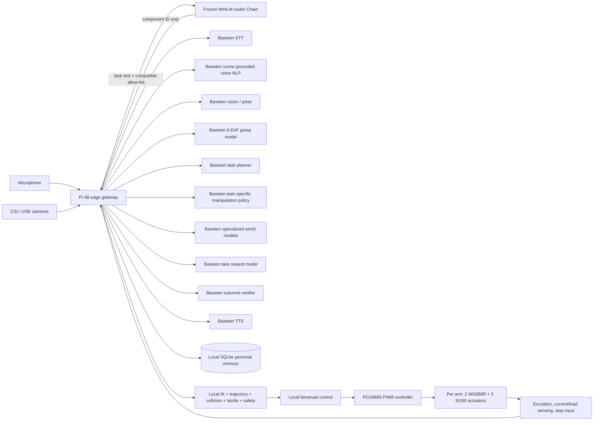

# Raspberry Pi 4B and Baseten architecture

The Raspberry Pi is the robot-side gateway. It captures sensors, retains the
user's local memory, enforces the component allow-list, and owns the arm-control
boundary. The router and inference models run remotely. The production path has
no automatic model fallback: a router, network, schema, or inference failure is
reported and physical execution does not begin.



## Why this split

Raspberry Pi 4 Model B has a quad-core Cortex-A72 CPU, 1–8 GB RAM depending on
the board, one exposed CSI camera connector, and a 5 V / 3 A supply requirement.
It is a good sensor and control gateway, but it is not the right host for all of
the vision, speech, planning, and simulation models at once. The official Pi 4
documentation also limits downstream USB current to about 1.1 A in aggregate.
Arm motors need their own correctly sized supply and controller; never power
them from the Pi's USB or GPIO rail. The Pi powers only PCA9685 logic and
communicates over I²C; a separate regulated servo supply feeds `V+`, with a
shared ground.

Baseten supports separately deployed models and Chains with independently
scaled components and parallel calls. That maps directly to this project's
exact capabilities. The Pi stores deployment proxies that use a few megabytes;
the GPU model memory remains in Baseten.

Official references:

- [Raspberry Pi 4 product brief](https://datasheets.raspberrypi.com/rpi4/raspberry-pi-4-product-brief.pdf)
- [Raspberry Pi 4 datasheet](https://datasheets.raspberrypi.com/rpi4/raspberry-pi-4-datasheet.pdf)
- [Baseten Chains architecture](https://docs.baseten.co/development/chain/design)
- [Baseten Chain invocation](https://docs.baseten.co/development/chain/invocation)

## Request flow

1. The Pi captures bounded camera frames and audio.
2. STT returns a transcript.
3. Perception returns object IDs, labels, confidence, 3D positions, estimated
   masses, and hazards.
4. Personal memory returns preferences, accommodations, recent comments,
   workspace context, and masses measured in earlier tasks.
5. The DUM-E-style voice NLP component grounds the transcript to the perceived
   object IDs using recent dialogue and personal context. An unresolved object
   produces a spoken clarification and stops the run.
6. A 6-DoF grasp specialist returns scored gripper poses and collision
   probabilities for every grounded target.
7. The planner proposes a small set of typed candidates. The compatibility gate
   forms the manipulation-policy pool, and the general text router chooses the
   best waypoint, bimanual ACT, pour, insert, lid, or handover specialist for
   each candidate. Policies return bounded action chunks, never raw motor
   authority.
8. Pi-side IK, trajectory generation, and collision checks validate each policy
   against current joint state, geometry, joint limits, and workspace clearance.
9. Each viable policy is evaluated concurrently by the learned forward-dynamics
   model and the relevant rigid, contact, bimanual, deformable, or human-motion
   world models. Each returns future poses, joints, forces, slip, collision
   probability, success, uncertainty, and risks through a 2–3 second horizon.
10. A task-reward model scores progress. Pi-side hard safety fuses world-model,
    collision, and tactile results. If every candidate is unsafe, execution stops.
11. The planner selects only a candidate that was generated and evaluated. The
    Pi rejects remote motor-control, IK, motion, tactile, and hard-safety components.
12. A local bimanual controller sends validated action chunks to both hardware
    drivers concurrently and stops both arms if either reports failure.
13. Outcome verification, failure classification, load estimation, and per-model
    prediction-error measurement close the model-based feedback loop.
14. Current/load sensing records measured object mass and execution issues.
    SQLite makes those facts available to later voice grounding, world-model,
    policy, and planning requests.
15. TTS speaks the status or clarification.

This is task-level orchestration. Network inference must never be placed inside
a servo-rate loop. Joint control, limits, collision interlocks, watchdogs, and
the emergency stop belong on the local motor controller and Pi-side driver.

## Component contract

[`examples/pi4_components.json`](../examples/pi4_components.json) is the edge
allow-list. Every component declares one or more exact, layer-prefixed
capabilities, and wildcards are rejected. These contracts define which experts
can exchange the requested typed data and which operations must stay local.
They do not encode a task-to-expert decision.

The compatible remote experts are described in
[`examples/physical_ai_specialists.json`](../examples/physical_ai_specialists.json).
Each declares one or more versioned interfaces, descriptions, and representative
routing phrases. The router receives task text plus only the IDs allowed by the
Pi, embeds the task and expert-owned prototypes with frozen MiniLM, and returns
the ID with the highest prototype cosine similarity.
The Pi maps that ID to its configured Baseten endpoint and validates it again.
It never accepts a URL or credential from the router.

The current capabilities are:

| Layer | Exact capability | Location |
| --- | --- | --- |
| Perception | `perception.scene` | Baseten vision/pose deployment |
| Personal intelligence | `personal.recall`, `personal.record` | Pi SQLite |
| Voice | `voice.transcribe`, `voice.ground`, `voice.synthesize` | Baseten deployments |
| Planning | `planning.candidates`, `planning.select` | Baseten planner Chain |
| Grasp | `grasp.pose_6d` | Baseten grasp deployment |
| Manipulation | `manipulation.skill.waypoint`, `.pour`, `.insert`, `.open_lid`, `.handover`; `manipulation.bimanual` | Separate Baseten policies |
| Kinematics | `kinematics.inverse` | Pi, robot-specific geometry |
| Motion | `motion.trajectory`, `motion.collision_check` | Pi |
| Dynamics | `dynamics.predict` | Baseten learned forward model |
| World | `world.rigid_dynamics`, `.grasp_contact`, `.bimanual_coordination`, `.deformable_dynamics`, `.human_motion` | Separate Baseten models |
| Reward and safety | `reward.task_progress`; `safety.risk` | Baseten reward; Pi hard safety |
| Tactile | `tactile.contact`, `.slip`, `.force`, `.grasp_stability` | Shared Pi tactile encoder |
| Control | `control.single_arm`, `control.bimanual` | Pi hardware driver only |
| Outcome | `outcome.verify`, `failure.classify`, `load.estimate` | Baseten verifier; Pi telemetry models |
| Feedback | `feedback.prediction_error`, `feedback.learn` | Pi calibration and load/issue learners |

The typed JSON decoder in `moira.contracts.decode_physical_response` validates
remote vision, voice, grasp, policy, world-model, reward, outcome, planner, and
TTS responses before downstream use. A voice model cannot invent an object ID
that perception did not return. World models must cover the configured horizon,
and every returned plan ID must match its candidate.

## Baseten setup

Deploy each model independently, or group tightly coupled model work in a
Chain. Keep the
router a small CPU Chain; a deployable template is in
[`deploy/baseten_router/router.py`](../deploy/baseten_router/router.py).

```bash
cd deploy/baseten_router
truss chains push router.py --dryrun
truss chains push router.py --promote
```

On the Pi, set the API key outside the manifest:

```bash
export BASETEN_API_KEY='...'
```

Create each remote factory with a `BasetenEndpoint` and `BasetenComponent`, then
load the allow-list with `ComponentRegistry.from_json`. The same universal
decoder handles the repository's physical model contract:

```python
from moira import (
    BasetenComponent,
    BasetenEndpoint,
    ComponentRegistry,
    PhysicalAI,
    load_robot_model,
    pca9685_arm_drivers,
    robot_bound_local_factories,
)
from moira.contracts import decode_physical_response


def remote_model(model_id, *, entity="model"):
    return lambda: BasetenComponent(
        BasetenEndpoint(model_id, entity=entity),
        decode=decode_physical_response,
    )


model = load_robot_model(
    "robot_models/four_dof_desktop_arm/model.json",
    verify_source=True,
)
left_driver, right_driver, pca = pca9685_arm_drivers(model)
factories = {
    **robot_bound_local_factories(model, left_driver, right_driver),
    "baseten-vision-scene": remote_model("VISION_MODEL_ID"),
    "baseten-grasp-pose": remote_model("GRASP_MODEL_ID"),
    "baseten-bimanual-act": remote_model("BIMANUAL_ACT_MODEL_ID"),
    "baseten-forward-dynamics": remote_model("DYNAMICS_MODEL_ID"),
    "baseten-rigid-world": remote_model("RIGID_WORLD_MODEL_ID"),
    "baseten-grasp-contact-world": remote_model("CONTACT_WORLD_MODEL_ID"),
    "baseten-bimanual-world": remote_model("BIMANUAL_WORLD_MODEL_ID"),
    "baseten-task-reward": remote_model("REWARD_MODEL_ID"),
    "baseten-stt": remote_model("STT_MODEL_ID"),
    "baseten-voice-nlp": remote_model("VOICE_NLP_MODEL_ID"),
    "baseten-tts": remote_model("TTS_MODEL_ID"),
    "baseten-task-planner": remote_model("PLANNER_CHAIN_ID", entity="chain"),
    # Supply SQLite, the calibrated tactile encoder, and remaining specialists too.
}

registry = ComponentRegistry.from_json(
    "examples/pi4_components.json",
    factories,
    ram_budget_mb=358,  # Typical profile for a 1 GB Pi 4B.
)
system = PhysicalAI.from_robot_model(registry, model)
```

Use `entity="chain"` for a Baseten Chain endpoint. Connect the router without a
fallback:

```python
from moira import RemoteComponentRouter

router = RemoteComponentRouter.from_baseten_chain(registry, "ROUTER_CHAIN_ID")
```

## Four-DOF desktop arm

The active SolidWorks assembly uses MG996R servos for base yaw and shoulder
pitch, plus SG90 servos for elbow pitch and the end-effector mechanism. MoIRA
emits three positioning angles and a separate aperture command. No payload
rating or joint limit from the retired arm is carried into this profile.

The supplied 3MF establishes millimetre print geometry for 12 unique meshes,
but its transforms are slicer plate placement rather than assembly poses. The
SolidWorks/Fusion export must supply the digital twin's joint frames and link
transforms. The existing PCA9685 and 6 V/10 A supply are recorded, while the new
installation state, channels, pulse endpoints, and SG90 voltage compatibility
remain unconfirmed. The future two-arm simulation fixture can continue to
exercise coordination, but production bimanual control stays unavailable until
both physical installations have independent calibration records.

The CAD model is not yet motion-ready. Exact link lengths, parent-frame joint
origins and axes, validated collision-mesh scale, coordinate frame, joint limits,
joint velocity limits,
actuator mapping, bimanual mount spacing, gripper aperture/force/speed, control
frequency, clearance, payload testing, safety thresholds, controller timing,
and physical calibration are required before the local kinematics, trajectory,
collision, safety, feedback, orchestration, and hardware components can be
constructed from it. Their `from_robot_model(...)` factories enforce the same
gate. `moira robot-model-check` reports every missing value. See the
[arm audit](four-dof-desktop-arm-audit.md) for the recovered metadata and
export procedure.

## Pi bring-up

Use 64-bit Raspberry Pi OS. The package core uses only the Python standard
library. Camera capture uses Raspberry Pi OS's `rpicam-still`; model inference
uses HTTPS and does not require the Baseten SDK on the Pi.

```bash
python -m venv .venv
./.venv/bin/python -m pip install -e .
./.venv/bin/moira pi-check --strict
./.venv/bin/moira physical-demo
```

`physical-demo` uses structured frames, simulated arms, and explicit voice
fixtures so it runs offline. These fixtures are never selected as substitutes
for unavailable cloud deployments.

For two cameras, use the Pi's CSI connector for one and a separately powered
USB camera for the other. The default profile processes at 640×480 and 10 FPS,
runs at most two short simulations concurrently, and budgets 35% of detected
RAM for loaded edge components, capped at 1.5 GB.

The voice design follows the same high-level path as the Hack the North 2025
[DUM-E project](https://devpost.com/software/dum-e-kgx6at): speech, computer
vision, fast language reasoning, and robot control. This implementation extends
that path with typed grounding, dialogue and personal context, parallel
simulation, bimanual steps, measured-load feedback, and strict local motor
authority.
