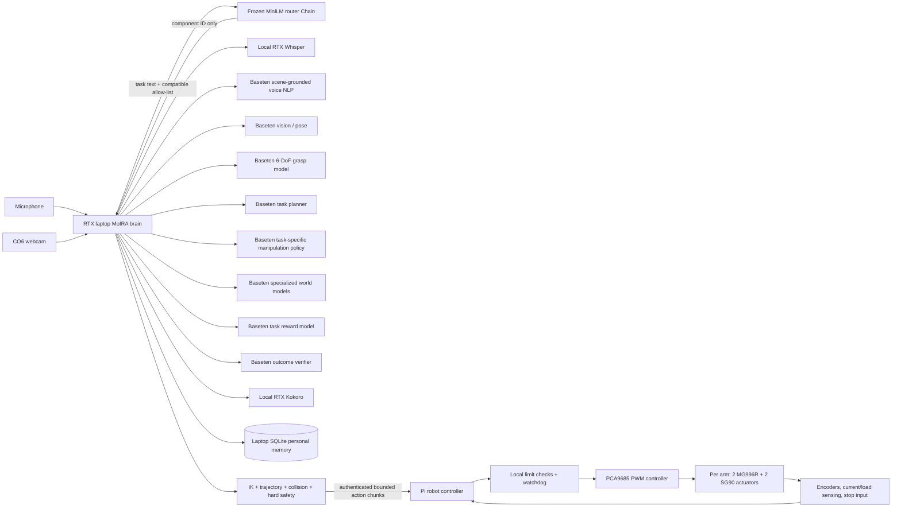

# Raspberry Pi 4B and Baseten architecture

The Raspberry Pi is the robot-side controller and owns the PCA9685 arm-control
boundary. The RTX laptop captures the CO6 webcam, retains personal memory,
enforces the component allow-list, runs orchestration and local GPU voice
models, and calls the remote router and specialist models. The production path
has no automatic model fallback: a camera, router, network, schema, or inference
failure is reported and physical execution does not begin.



## Why this split

Raspberry Pi 4 Model B has a quad-core Cortex-A72 CPU, 1–8 GB RAM depending on
the board, one exposed CSI camera connector, and a 5 V / 3 A supply requirement.
It is a good sensor and control gateway, but it is not the right host for all of
the vision, speech, planning, and simulation models at once. The official Pi 4
documentation also limits downstream USB current to about 1.1 A in aggregate.
Arm motors need their own correctly sized supply and controller; never power
them from the Pi's USB or GPIO rail. The Pi powers only PCA9685 logic and
communicates over I²C; a separate regulated servo supply feeds `V+`, with a
shared ground.

Baseten supports separately deployed models and Chains with independently
scaled components and parallel calls. That maps directly to this project's
exact capabilities. The laptop stores deployment clients and orchestration
state; the GPU model memory remains in Baseten and local RTX services.

Official references:

- [Raspberry Pi 4 product brief](https://datasheets.raspberrypi.com/rpi4/raspberry-pi-4-product-brief.pdf)
- [Raspberry Pi 4 datasheet](https://datasheets.raspberrypi.com/rpi4/raspberry-pi-4-datasheet.pdf)
- [Baseten Chains architecture](https://docs.baseten.co/development/chain/design)
- [Baseten Chain invocation](https://docs.baseten.co/development/chain/invocation)

## Request flow

1. The laptop records bounded audio and CO6 JPEG frames with camera identity and
   capture timestamps.
2. STT returns a transcript.
3. Perception returns object IDs, labels, confidence, 3D positions, estimated
   masses, and hazards.
4. Personal memory returns preferences, accommodations, recent comments,
   workspace context, and masses measured in earlier tasks.
5. The DUM-E-style voice NLP component grounds the transcript to the perceived
   object IDs using the current transcript and active dialogue. Personal memory
   supplies preferences and accommodations, but historical comments cannot
   authorize a physical target. An unresolved object produces a spoken
   clarification and waits for a bounded follow-up turn.
6. A 6-DoF grasp specialist returns scored gripper poses and collision
   probabilities for every grounded target.
7. The planner proposes a small set of typed candidates. The compatibility gate
   forms the manipulation-policy pool, and the general text router chooses the
   best waypoint, bimanual ACT, pour, insert, lid, or handover specialist for
   each candidate. Policies return bounded action chunks, never raw motor
   authority.
8. Laptop-side IK, trajectory generation, and collision checks validate each policy
   against current joint state, geometry, joint limits, and workspace clearance.
9. Each viable policy is evaluated concurrently by the learned forward-dynamics
   model and the relevant rigid, contact, bimanual, deformable, or human-motion
   world models. Each returns future poses, joints, forces, slip, collision
   probability, success, uncertainty, and risks through a 2–3 second horizon.
10. A task-reward model scores progress. Laptop hard safety fuses world-model,
    collision, and tactile results; the Pi independently enforces calibrated
    command envelopes. If every candidate is unsafe, execution stops.
11. The planner selects only a candidate that was generated and evaluated. The
    laptop never receives raw PWM authority; the Pi rejects unbound, duplicate,
    mismatched, uncalibrated, or disabled motion requests.
12. Before physical execution, the system reads the interpreted command and
    selected candidate back to the user. A fresh confirmation is bound to that
    exact intent and plan. Corrections trigger full replanning; a changed plan
    requires confirmation again. A fresh camera frame blocks moved or missing
    targets and new hazards. Further camera checks run between action steps,
    keeping stationary destinations under observation and watching the
    manipulated object until planned lift or transfer begins.
13. The laptop sends only validated action chunks to the authenticated Pi robot
    endpoint. The Pi checks the robot ID, CAD digest, request uniqueness, chunk
    binding, timing, calibrated joint and gripper envelopes, then drives the
    installed hardware concurrently and stops every arm if one reports failure.
    A parallel bounded microphone listener recognizes local stop phrases during
    movement and calls the interruptible PCA9685 driver. The stop remains
    latched until the operator checks the workspace and restarts the runtime.
14. Outcome verification, failure classification, load estimation, and per-model
    prediction-error measurement close the model-based feedback loop.
15. Current/load sensing records measured object mass and execution issues.
    SQLite makes those facts available to later voice grounding, world-model,
    policy, and planning requests.
16. TTS speaks the status or clarification.

This is task-level orchestration. Network inference must never be placed inside
a servo-rate loop. Joint control, limits, collision interlocks, watchdogs, and
the emergency stop belong on the local motor controller and Pi-side driver.

## Component contract

[`examples/pi4_components.json`](../examples/pi4_components.json) is the edge
allow-list. Every component declares one or more exact, layer-prefixed
capabilities, and wildcards are rejected. These contracts define which experts
can exchange the requested typed data and which operations must stay local.
They do not encode a task-to-expert decision.

The compatible remote experts are described in
[`examples/physical_ai_specialists.json`](../examples/physical_ai_specialists.json).
Each declares one or more versioned interfaces, descriptions, and representative
routing phrases. The router receives task text plus only the IDs allowed by the
laptop registry, embeds the task and expert-owned prototypes with frozen
MiniLM, and returns the ID with the highest prototype cosine similarity. The
laptop maps that ID to its configured endpoint and validates it again. It never
accepts a URL or credential from the router.

The current capabilities are:

| Layer | Exact capability | Location |
| --- | --- | --- |
| Perception | `perception.scene` | Baseten vision/pose deployment |
| Personal intelligence | `personal.recall`, `personal.record` | Laptop SQLite |
| Voice | `voice.transcribe`, `voice.ground`, `voice.synthesize` | Laptop RTX STT/TTS; Baseten grounding |
| Planning | `planning.candidates`, `planning.select` | Baseten planner Chain |
| Grasp | `grasp.pose_6d` | Baseten grasp deployment |
| Manipulation | `manipulation.skill.waypoint`, `.pour`, `.insert`, `.open_lid`, `.handover`; `manipulation.bimanual` | Separate Baseten policies |
| Kinematics | `kinematics.inverse` | Laptop, robot-specific geometry |
| Motion | `motion.trajectory`, `motion.collision_check` | Laptop planning; Pi calibrated envelopes |
| Dynamics | `dynamics.predict` | Baseten learned forward model |
| World | `world.rigid_dynamics`, `.grasp_contact`, `.bimanual_coordination`, `.deformable_dynamics`, `.human_motion` | Separate Baseten models |
| Reward and safety | `reward.task_progress`; `safety.risk` | Baseten reward; laptop fusion; Pi command gate |
| Tactile | `tactile.contact`, `.slip`, `.force`, `.grasp_stability` | Robot sensors through Pi telemetry |
| Control | `control.single_arm`, `control.bimanual` | Pi hardware driver only |
| Outcome | `outcome.verify`, `failure.classify`, `load.estimate` | Baseten verifier; laptop telemetry models |
| Feedback | `feedback.prediction_error`, `feedback.learn` | Laptop memory from Pi telemetry |

The typed JSON decoder in `moira.contracts.decode_physical_response` validates
remote vision, voice, grasp, policy, world-model, reward, outcome, planner, and
TTS responses before downstream use. A voice model cannot invent an object ID
that perception did not return. World models must cover the configured horizon,
and every returned plan ID must match its candidate.

## Baseten setup

Deploy each model independently, or group tightly coupled model work in a
Chain. Keep the
router a small CPU Chain; a deployable template is in
[`deploy/baseten_router/router.py`](../deploy/baseten_router/router.py).

```bash
cd deploy/baseten_router
truss chains push router.py --dryrun
truss chains push router.py --promote
```

On the laptop, set the API key outside the manifest. The Pi does not receive
Baseten credentials:

```bash
export BASETEN_API_KEY='...'
```

The production config creates the laptop registry, cloud clients, local camera,
and authenticated Pi controller without placing model credentials on the robot:

```python
import os

from moira import OpenCVCameraSource
from moira.production import build_physical_session, load_physical_runtime_config

config = load_physical_runtime_config("config/pi4_runtime.json")
camera_device = os.environ[config.camera.device_env]
camera_source = int(camera_device) if camera_device.isdecimal() else camera_device
camera = OpenCVCameraSource(camera_source, camera_id=config.camera.camera_id)
session = build_physical_session(config, (camera,))
```

The router remains a required Baseten Chain. No local LLM or automatic model
fallback is selected if the router, specialist, or Pi robot endpoint fails.

## Four-DOF desktop arm

The active SolidWorks assembly uses MG996R servos for base yaw and shoulder
pitch, plus SG90 servos for elbow pitch and the end-effector mechanism. MoIRA
emits three positioning angles and a separate aperture command. No payload
rating or joint limit from the retired arm is carried into this profile.

The supplied 3MF establishes millimetre print geometry for 12 unique meshes,
but its transforms are slicer plate placement rather than assembly poses. The
SolidWorks/Fusion export now supplies five assembled link meshes, four analytic
joint axes, a Y-up frame, and 154.14 mm/100.10 mm link spacing. The kinematic
MuJoCo model compiles and passes per-joint hierarchy checks. The existing
PCA9685 and 6 V/10 A supply are recorded. Arm #1 is installed with channels
0–3 assigned in joint order; pulse endpoints and SG90 voltage compatibility
remain unconfirmed. The future two-arm simulation fixture can continue to
exercise coordination, but production bimanual control stays unavailable until
both physical installations have independent calibration records.

The robot is not yet motion-ready. Physical joint limits and velocities,
actuator mapping, bimanual mount spacing, gripper aperture/force/speed, control
frequency, clearance, payload testing, safety thresholds, controller timing,
mass/inertia/friction, and physical calibration are still required before the
local kinematics, trajectory, collision, safety, feedback, orchestration, and
hardware components can be constructed from it. Their
`from_robot_model(...)` factories enforce the same gate. `moira
robot-model-check` reports every missing value. See the
[arm audit](four-dof-desktop-arm-audit.md) for the recovered metadata and
export procedure.

## Pi bring-up

Use 64-bit Raspberry Pi OS. The Pi installs only the core and PCA9685 hardware
dependencies; it does not install OpenCV, router weights, model SDKs, or cloud
credentials.

```bash
python3 -m venv .venv
./.venv/bin/python -m pip install -e ".[hardware]"
./.venv/bin/moira pi-check --strict
./.venv/bin/moira-pi-controller \
  --host 0.0.0.0 \
  --port 8770 \
  --model robot_models/four_dof_desktop_arm/model.json
```

This command is intentionally locked. It exposes health and emergency-stop
handling but returns HTTP 423 for motion. Add `--enable-motion` only after the
calibrated model passes readiness checks; the service still opens I2C lazily on
the first authenticated execution request.

For the current `client` Pi account, install the repository's locked systemd
unit so the controller starts after networking and restarts after a process
failure:

```bash
sudo install -m 644 deploy/pi/moira-robot-controller.service \
  /etc/systemd/system/moira-robot-controller.service
sudo systemctl daemon-reload
sudo systemctl enable --now moira-robot-controller.service
```

The checked-in unit deliberately omits `--enable-motion`. Calibration completion
does not silently unlock the arm; enabling physical motion remains a separate,
reviewable deployment change.

The CO6 camera remains attached to the laptop and is never substituted by a Pi camera.

The voice design follows the same high-level path as the Hack the North 2025
[DUM-E project](https://devpost.com/software/dum-e-kgx6at): speech, computer
vision, fast language reasoning, and robot control. This implementation extends
that path with typed grounding, dialogue and personal context, parallel
simulation, bimanual steps, measured-load feedback, and strict local motor
authority.
